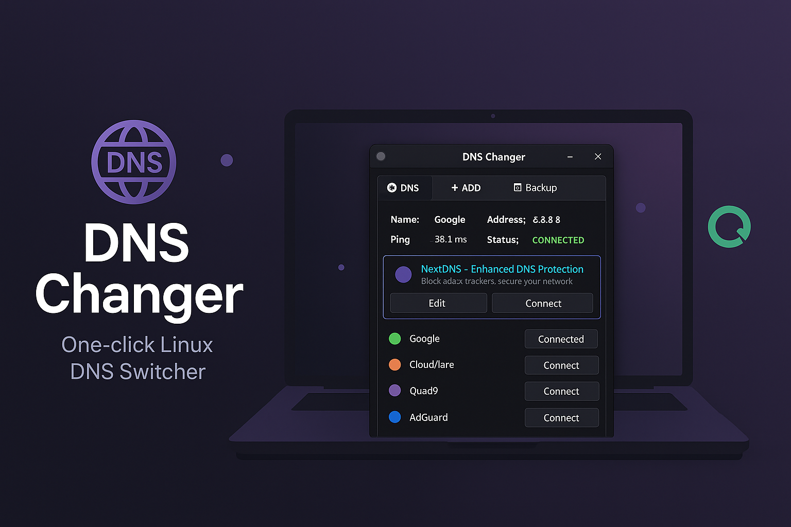
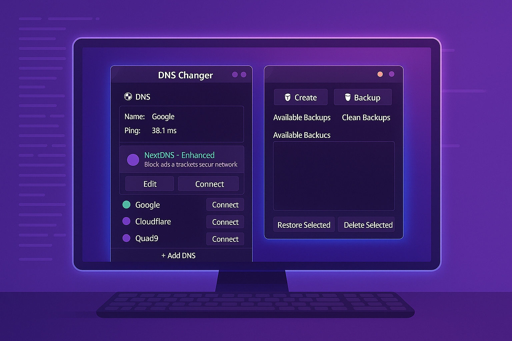

<p align="center">
  
</p>

<p align="center">
  <!-- Project stats -->
  
  
  
  
  
</p>

# DNS Changer 🚀

Simple, powerful, one-click DNS server changer app **made for Linux**!  
A lightweight desktop application to quickly switch between DNS servers (NextDNS, Cloudflare, Google, etc.) with real-time ping testing.

---

## 📑 Table of Contents
- [📌 Features](#-features)
- [❓ Why use dns changer](#-why-use-dns-changer)
- [💾 Installation](#-installation)
- [🚀 Usage](#-usage)
- [🛡️ Privacy](#-privacy)
- [🦠 Antivirus Result](#-antivirus-result)
- [📦 Releases](#-releases)

---

## 📌 Features
- Change DNS settings with a single command  
- **Built-in & custom DNS provider widgets** for easy selection and management  
- Modular UI components (`widgets.py`, `panels/`) for a clean, extensible interface  
- Backup and restore DNS configurations  
- Lightweight, fast, and Linux-only  

---

## ❓ Why use DNS Changer?
This app is simple and easy to use—just one click to change your DNS server.  
It offers built-in ad-blocking and filtering, reduces ping for faster responses, and is designed with a privacy-focused mindset.

---

## 💾 Installation

1. **[Download the pre-built binary](https://github.com/kun-create/dns-changer/releases/latest/download/dns-changer) (recommended)**  

   ```bash
   curl -L -o dns-changer https://github.com/kun-create/dns-changer/releases/latest/download/dns-changer
   chmod +x dns-changer
   ./dns-changer```

2. **Or build from source with Nuitka**

   ```bash
   python -m nuitka \
     --onefile \
     --follow-imports \
     --enable-plugin=tk-inter \
     --include-package=tksvg \
     --include-package=tkfontawesome \
     --include-package-data=tksvg \
     --include-package-data=tkfontawesome \
     --include-data-files=./logo/logo40.png=./logo/logo40.png \
     --include-data-files=./data/dns_configs.json=./data/dns_configs.json \
     --include-data-files=./data/promo_nextdns.json=./data/promo_nextdns.json \
     --linux-icon=./logo/logo40.png \
     --company-name='Kun Create' \
     --product-name='DNS Changer' \
     --file-description='GUI tool to switch DNS on Linux' \
     --file-version=1.0.0 \
     --product-version=1.0.0 \
     --assume-yes-for-downloads \
     --lto=yes \
     --static-libpython=auto \
     --remove-output \
     --output-filename=dns-changer \
     main.py
   ```

---

## 🚀 Usage

```bash
./dns-changer
```

1. **Select a provider** via the DNS provider widgets on the main tab
2. Click **Connect** to apply your choice
3. Use the **Backup/Restore** panel to manage snapshots of your DNS configuration

<p align="center">
  
</p>

---

## 🛡️ Privacy

DNS Changer operates **100 % locally**:

* No telemetry, user-tracking or analytics
* DNS profiles are stored under `~/.config/dns-changer` in plain JSON
* Network changes are applied with standard Linux `resolv.conf` methods and never sent to external servers
  Your data never leaves your machine.

---

## 🦠 Antivirus Result

The latest release binary was scanned at VirusTotal and reported **0 detections**.
🔗 [View full scan report](https://www.virustotal.com/gui/file/e60a3d7f19234c2d4ff754a4304fc66aa0da081076562240e08274c10583c9c9)

---

## 📦 Releases

We **strongly recommend** using the pre-built `dns-changer` binary for the fastest setup:

```bash
chmod +x dns-changer
./dns-changer
```

Grab it from the [Releases page](https://github.com/kun-create/dns-changer/releases/latest).

---